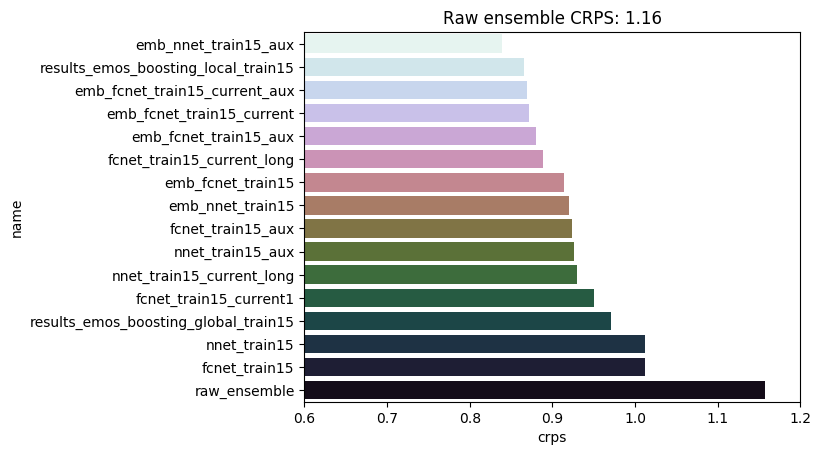

# Post-processing with Neural Nets

## Data

### Forecasts

**ECMWF forecasts from TIGGE dataset**

https://software.ecmwf.int/wiki/display/TIGGE/Models

- Variables: T2M
- Time period: 2007-01-02 -- 2017-01-02 (forecasts for forecast initializations between 2007-01-01 and 2016-12-31)
- Forecast initialization time: 00UTC
- Members: 50
- Forecast lead time: 36h and 48h (valid at 12 and 00UTC)
- area: -10E to 30E; 30N to 70N (large part of Europe centered around Germany)
- resolution: 0.5 degrees

### Observations

**DWD SYNOP stations**

- Number of stations: 537
- Variables: T2M (longitude, latitude and altitude for each station)
- There is missing observation data!

## Post-processing

### Standard EMOS

Using a rolling training period of the previous 25 (global model) / 360 (local model) days.

| Method | Description | CRPS for 2016 (no guarantee this is correct, needs automation!) |
| ------ | ----------- | -------------- |
| Global | Use all stations to train one model | 1.01 |
| Local  | Only use data from station of interest | 0.92 |

The results are in the directory: `standard_postprocessing/preliminary_results`

### Neural Networks

- Minimize CRPS using Stochastic Gradient Descent (or more sophisitcated method in the future)
- In the future: Add more predictor variables
	- Start with more variables at each station, such as wind, humidity (need to think about this in detail.)
	- Add neighborhood information from the ensemble

| Method | Description | CRPS for 2016 |
| ------ | ----------- | ------------- |
| EMOS network (global with rolling window as in standard EMOS) | A network mimicking what EMOS does. | 1.00 |
| EMOS network (train 2015, predict 2016) | | 1.01 |
| Fully connected linear network | 6 parameters | 1.01 |
| Hidden layer neural net | | 1.02 | 
| Hidden layer neural net with station embedding | | 0.91 | 
| Hidden layer neural net with auxiliary data | | 0.94 |
| Hidden layer neural net with embeddings and aux data | | 0.86 |  

## Results

